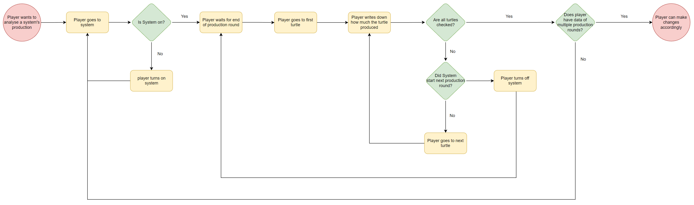
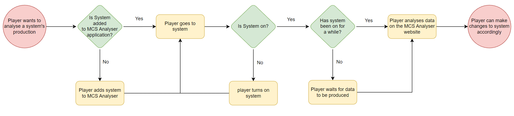
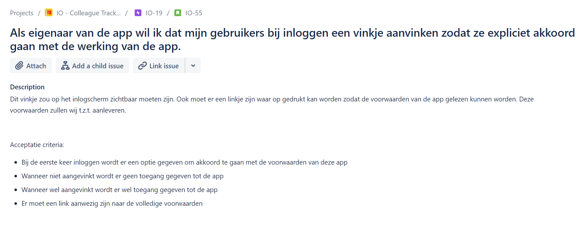
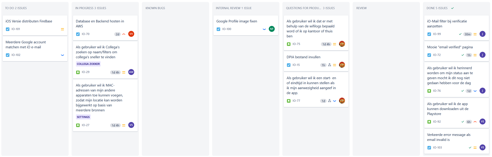
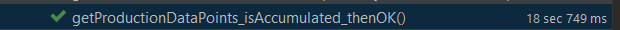
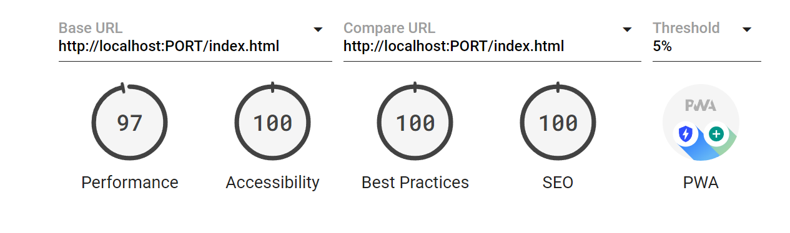
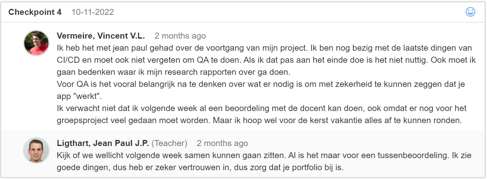

# Portfolio S3

## Table of Contents
- [Portfolio S3](#portfolio-s3)
  * [Introduction](#introduction)
  * [Individual Project: F1 Guesser](#individual-project--f1-guesser)
  * [Individual Project Description: MCS Analyser](#individual-project-description--mcs-analyser)
    + [But what is MCS-CC?](#but-what-is-mcs-cc-)
    + [User Stories](#user-stories)
  * [Business process](#business-process)
  * [Full-Stack Web Application](#full-stack-web-application)
    + [Front End](#front-end)
    + [Back End](#back-end)
    + [Persistence](#persistence)
  * [External Services](#external-services)
    + [Systems and Services explained](#systems-and-services-explained)
  * [Project Management](#project-management)
    + [Group project management](#group-project-management)
    + [Individual Project management](#individual-project-management)
  * [Quality Assurance](#quality-assurance)
    + [Integration Tests](#integration-tests)
    + [Google Lighthouse (Performance testing and more)](#google-lighthouse--performance-testing-and-more-)
    + [User Experience Tests](#user-experience-tests)
  * [Continuous Integration & Delivery](#continuous-integration---delivery)
    + [Integration](#integration)
    + [Delivery](#delivery)
  * [Deployment](#deployment)
  * [Ethics](#ethics)
    + [The Colleague Tracker for IO](#the-colleague-tracker-for-io)
      - [Collection of Data](#collection-of-data)
      - [Data Protection](#data-protection)
    + [Ethics within our team](#ethics-within-our-team)
  * [Cultural Differences](#cultural-differences)
    + [The Hofstede Cultural Framework](#the-hofstede-cultural-framework)
    + [Differences at my job](#differences-at-my-job)
    + [My opinion](#my-opinion)
  * [Professionalism](#professionalism)
    + [Feedpulse](#feedpulse)
    + [Retrospectives](#retrospectives)
    + [Reflection](#reflection)


## Introduction
This semester has the goal to work on a group project for an external company and to build a Full-Stack web application as an individual project. Together with these projects there are many learning outcomes that should be achieved. This document will show how I worked towards my so called LO’s.

## Individual Project: F1 Guesser
At the beginning of the semester I first wanted to do a project about Formula 1. In the end I ended up doing another project called: MCS Analyser. More about the F1 project can be found [here](https://github.com/crazyvinvin/Portfolio-S3/blob/main/F1Guesser.md).

## Individual Project Description: MCS Analyser
I want to build a web application that gives users the ability to see and analyse data produced by robots on a Minecraft server. These Robots are part of a mod called MCS-CC.

Take a look at the project in action [here](https://analyser.mcsynergy.nl)

### But what is MCS-CC?
MCS-CC, also known as Minecraft Synergy Computer Craft, is a by us (the MCS Team) made modification of the popular mod: “CC: Tweaked” (Which is also on itself a modification of another mod). CC: Tweaked adds programmable turtles and computers to Minecraft (Java edition). These turtles are essentially robots that can perform certain actions like digging blocks or moving items from one place to another. To have a turtle (or computer) perform an action you can write a script in a language called Lua which is then ran in the Lua Virtual Machine to actually make the turtle do something.

Using these computers and turtles you can automate almost everything in the game. 

### User Stories
I’ve created a few user stories to make the project and its functionality more clear. I chose user stories over requirements, because I already created requirements for my last project and want to see the difference.

- US-01: As a user I want to be able to see a system’s data displayed as a graph, so that I can analyse and monitor the system.
- US-02: As a user I want to be able to change a graph’s timespan so that I can analyse data over different amounts of time.
- US-03: As a user I want to see new data as soon as it’s available so that I can react to an unexpected situation quickly.
- US-04: As a user I want to be able to see if a system is turned on or off so that I know why a system is producing different data then before.
- US-05: As a user I want to be able get a description of a system about it’s service and purpose so that I can understand the data more easily.
- US-06: As a user I want to be able to create a custom graph with all the data available so that I can compare different systems with each other.

## Business process
When building software, you're always doing this with a goal. To automate or improve a process that's happening somewhere or to create a new process that wasn't possible without your software. To visualize all the different parts and blocks of a process, a business process model (or BPM for short) can be created. In the world of software a BPM can show how software improves (or worsens) a process.

I will be creating a BPM about how we analyse MCS Systems now and a BPM about the process after the software for my individual project is build. This to visualize the difference between before and after the software is build.



Above is the model of the process without using the MCS Analyser software. As you can see it is very cluttered and contains a lot of long loops to manually collect data. This is far from optimal and makes it almost impossible to actually make effective changes to systems when collecting and analysing data like this.



This model shows the process using the MCS Analyser software. As seen on the left, players will have to add their system to the MCS Analyser. This is definitely an inconvenience, but cannot be automated. This will however only have to be done once for every system. A guide for players on how to add a system to the MCS Analyser can be found [here](https://github.com/MC-Synergy/MCSAnalyser-FrontEnd#how-can-i-add-my-system-to-the-analyser).

## Full-Stack Web Application
### Front End
For the front-end part of the application I have to use a JavaScript framework. After a bit of research about what options are available, it quickly comes down to Vue and React.  I haven’t done a lot with JavaScript before so I played around a little with both of the frameworks to see which one I would like more. I found out that anything and everything is possible with both of the frameworks, but React felt more intuitive to me. As a result I have chosen to build my front-end with ReactJS.

Click [here](https://github.com/MC-Synergy/MCSAnalyser-FrontEnd) to go to the front end repository.

### Back End
For the back-end part of the application I want to work with an object oriented language. This means the big options are C# and Java. It’s important for a software engineer to be able to learn and apply new technologies. I have been using C# in the last two semesters and really want to expand my knowledge towards Java. I have no experience with Java at this point, but it’s one of the most used object oriented languages for back-end applications. One of the best Java frameworks for REST applications is Java Spring. This is also what I will be using for my project.

Click [here](https://github.com/MC-Synergy/MCSAnalyser-API) to go to the back end repository.

### Persistence
One of the (few) mandatory things this semester is that I learn about an Object-Relational Mapper and how to apply that knowledge in my project. Object relational mapping is, simply said, a technique that lets you manage data in database without having to write data access logic (because the ORM serves as the data access layer!). ORM has a lot of pros and cons, they can for example be very overwhelming to use and aren’t always the most performant. Nonetheless ORM’s can be super useful to abstract your database and save you a lot of time.

Hibernate is a framework that implements object relational mapping for Java applications. Part of the Spring framework is Spring Data JPA, which is an extra layer of abstraction on top of hibernate. Hibernate makes it possible to switch a project’s database without changing the back-end code, while Spring Data JPA reduces the needed back-end code to implement hibernate. I will be using Spring Data JPA together with hibernate and MySQL to achieve persistence in MCS Analyser.

## External Services
MCS Analyser will be using multiple external services made by the MCS Team. Most of these services will be used to gather data to be displayed by the analyser. There has also been the idea to authorize all of the MCS Services. This would mean that MCS Analyser would use the MCS Authentication Provider to authenticate our users.

To create a better understanding of how the different MCS Services interact with each other, I have designed a system context diagram following level 1 of the C4 model pattern.


 
### Systems and Services explained
In this document there has been a lot of talk about MCS Systems and MCS Services, but what is the difference? MCS Systems are the systems inside the Minecraft server. For example a farm that produces melons and pumpkins is called an MCS System. All the systems are registered at the MCS Systems API. MCS Services are the things we build outside of the Minecraft server. For example the MCS Analyser and the MCS Turtle Tracker are both MCS Services.

## Project Management
When working on a project, no matter the size, management is important. However, the way one project should be managed can be really different from another project. Things like teamsize, stakeholders and  time schedules can have a huge influence on the project and will thereby change the way the project should be managed. This semester, I did a group project and an individual project and I found out that these projects had to be managed very different from eachother.

### Group project management
With a team of 5 software engineering students we did a project for IO, an external company that helps companies grow digitally. We were assigned two stakeholders that would act as our customers. These gave us the task to create an app that would help them find their colleagues more quickly when needed.

To manage this project we chose to work with the scrum framework, which is one of the agile methodologies. More on how we could improve the team by using an Agile Methodology can be found [here](https://github.com/crazyvinvin/Portfolio-S3/blob/main/Research/Agile.md). To work agile we needed a tool to manage user stories and issues. For this we used Jira, a tool for keeping track of issues and managing agile projects. We used Jira, because it was one of the recommended tools by Canvas while also already being used by our stakeholders at IO. 

It took some time for us to get used to working with Jira. Jira itself is already a pretty complex piece of software and our stakeholders had a very specific way of working with it, but after a few weeks we started to get more comfortable using it. 

Not only with a new user story, but also when we needed something from our stakeholders, we would open an issue in Jira. Here is an example:



When planning the sprint, together with our stakeholders we would select tickets that would be worked on during the sprint. When work started on a ticket we would move it to the "in progress" state. Like the "in progress" state, we had many more states that tickets could be moved to. For example the "Questions for product owners", which was used when questions came up that would put the ticket on hold until they were answered. Here is an example of our Jira board:


*This image was taken by Josian van Efferen, a member of the team.

Jira also has a tool to create a sprint burndown chart. A burndown chart shows how a sprint progresses over time. To create a burndown chart, we had to start estimating how much time an issue would take the team to complete and how long it ended up taking us. Accurately estimating how much time an issue would take has been really difficult, however practice makes perfect.

I took up the role as scrum master this semester, acting as the communication point for the stakeholders of IO and ofcourse our teacher. It also was my job to lead the stand ups and other meetings we had with the team while making sure our Jira board stayed updated.

The hardest thing I found as a scrum master has been to keep the team motivated at all times. When a delivery to our stakeholders doesn't go as well as hoped, I found that people would start to distract themselves. Keeping them focused on what had to be done to fix things or to create a better delivery next sprint could sometimes be very difficult. 

### Individual Project management
TODO
github issues, stakeholders, more of a kanban style

## Quality Assurance
Assuring the quality of software is one of the most important things in software development as it helps you to find problems before they become an issue. There are many different subjects in software which "the quality can be assured of". For my project a few things are important. First of all, the data that is displayed in the graphs should be correct and not be misleading. Both of these things could lead to misunderstanding of the data that a system produces, which would be a problem for the further development of the system. Second, a user (player from the minecraft server) should be able to easily find what they are looking for and understand the data that a system is producing, even if they don't have an understanding about the development of MCS Systems.
To test if these things are working as needed, I will be doing Integration Tests and User Experience Tests. I will also be running performance and accessibility tests through google lighthouse, because this will help to find issues with the user experience and google lighthouse can also scan for vulnerability issues.

### Integration Tests
Integration testing is important when building software that has to be stable and accurate. Using integration tests you can not only find problems in your software now, but also in the future. When building a new feature, something old might break. These tests can help to visualize these issues so the developers can resolve the problem before the software gets delivered. 

While creating my tests, two of my tests that had to do with the accumulation of data actually failed. After some more testing, it looked like the accumulation method I wrote, did the exact opposite or double of what I asked it to do. Later I found out this was because I was calling the method a second time somewhere, which was definitely not meant. Problems like this are hard to find out without building some simple tests.



I have also added the execution of the integration tests to the continuous integration workflow. Read more about that [here](#integration).

### Google Lighthouse (Performance testing and more)
Google lighthouse runs a number of diagnostics on your web application to see how it performs and which best practices it misses. I have setup a lighthouse server and am running lighthouse in the integration workflow. More about this can be read in the [Continuous Integration](https://github.com/crazyvinvin/Portfolio-S3/edit/main/README.md#integration) chapter of this portfolio.

Lighthouse detected a few issues with my project, for example it noticed that I was still getting and sending some data over http instead of https. Which means the data is not encrypted and can be read by almost anyone. This was a simple fix but could have been a major issue if this data was user data. After fixing this issue, the scores came out pretty good:



These results will ofcourse change every time changes are made to the project. Scores for all the integrations of code can be viewed [here](https://lighthouse.mcsynergy.nl/app/projects/mcsanalyser-frontend/dashboard)

### User Experience Tests
Onderzoek is gedaan, ik moet het alleen nog uitwerken.

## Continuous Integration & Delivery
Integrating new code into an application takes developers a lot of time. That's why I have automated the integration, delivery and deployment of new code. To automate this process I have created workflows with GitHub Actions. These workflows are triggerd on push or accepted pull requests on the development and main branches of the projects. There are workflows for building and testing the code, aswell as there are workflows for building and delivering docker images to a self-hosted docker registry.

Workflows exist of jobs that are run by so called GitHub Runners. We are currently hosting our own GitHub Runners, however I really wanted to set my GitHub Repository to public but this came with some complications. You can read more about this in my Research Article: [How can I safely allow GitHub Actions Jobs on a public repository?](https://github.com/crazyvinvin/Portfolio-S3/blob/main/Research/safely-allow-actions-on-public-repo.md)

### Integration
When a pull request is opened against the development or main branch of the front end repository or when a push to the development branch happens, the integration workflow is run.

``` yaml
# integrate.yml
---
name: integrate

on:
  pull_request: 
    branches: ["main", "dev"]
  push:
    branches: ["dev"]
  workflow_dispatch:

jobs:
  build:
    runs-on: ubuntu-latest
    steps:
      - uses: actions/checkout@v3
      - uses: actions/setup-node@v3
        with:
          node-version: 18.12.1
      - name: setup git config
        run: |
          git config user.name "GitHub Actions Bot"
          git config user.email "<>"
        
      - name: install dependencies
        run: npm ci
      
      - name: Build code
        run: npm run build
```
The integration workflow has a job that builds the application. If the code has build errors, the workflow will fail which will be visible on github and it will also be emailed to the developer.

There is also an integration workflow for the back end of my project. This workflow has a job that builds the project. When building a project with maven, it also executes the tests that are found in the project. 


### Delivery
To deliver new code, a few steps have to be processed:
- Build the code
- Build the Docker image
- Login to self-hosted registry
- Push Docker image to registry

``` Dockerfile
# Dockerfile
FROM node:19-alpine as builder
WORKDIR /app

COPY package*.json ./

RUN npm ci

COPY . .

RUN npm run build

FROM nginx:1.23.1-alpine as production
ENV NODE_ENV production
COPY --from=builder /app/build /usr/share/nginx/html
COPY nginx.conf /etc/nginx/conf.d/default.conf

CMD ["nginx", "-g", "daemon off;"]
```

The docker file is responsible for installing the code's dependencies, building the code and then building the Docker image.

``` yaml
# deliver.yml
---
name: Deliver

on: 
  push:
    branches: ["main"]
  pull_request_review:
    types: [submitted]
  workflow_dispatch:

jobs:
  Docker:
    runs-on: ubuntu-latest
    steps:
      - uses: actions/checkout@v3
      
      - name: Login to registry
        run: >
          echo ${{ secrets.REGISTRY_PASSWORD }}
          | sudo docker login registry.mcsynergy.nl
          -u ${{ secrets.REGISTRY_USERNAME }} --password-stdin
      
      - name: Build image
        run: >
          sudo docker build . --file Dockerfile
          --tag registry.mcsynergy.nl/mcsa-frontend:latest
      
      - name: Push to registry
        run: sudo docker push registry.mcsynergy.nl/mcsa-frontend:latest
```
The delivery workflow runs the dockerfile to create a new image. It then logs in to the registry and pushes the newly created image. The reason why I have chosen to host my own registry is because on the docker-hosted registry you have to pay to store more than 1 private image. I want to store atleast 2 private images and probably even more in the future. The registry is authenticated using basic username and password authentication.

## Deployment
At home I have a super old intel NUC that serves as my server. To be able to really use my application I had to deploy the Docker images stored in my registry as Docker containers. To do this I have written a docker-compose file for each application. 

``` yaml
# docker-compose.yml
version: '3.8'

name: MCSAnalyser
networks:
  mcsa-net:
    external: true

services:
  mcsa-server:
    container_name: MCSA-API
    restart: always
    environment:
      SPRING_DATASOURCE_URL: 'jdbc:mysql://MCSA-Database:3306/mcsaDB'
      SPRING_DATASOURCE_USERNAME: 'root'
      SPRING_DATASOURCE_PASSWORD: '****'
      SPRING_JPA_HIBERNATE_DDL-AUTO: 'update'
      SPRING_JPA_DATABASE-PLATFORM: 'org.hibernate.dialect.MySQL5InnoDBDialect'
      SERVER.SERVLET.CONTEXT-PATH: ''
      CREATEDATABASEIFNOTEXISTS: true
      SERVER_PORT: 8081
      SERVER_ADDRESS: 0.0.0.0
    image: registry.mcsynergy.nl/mcsaserver:latest
    ports:
      - "8081:8081"
    depends_on:
      - mcsa-db
    networks: 
      - mcsa-net

  mcsa-db:
    image: mysql:latest
    restart: always
    container_name: MCSA-Database
    environment:
      MYSQL_DATABASE: 'mcsaDB'
      MYSQL_ROOT_PASSWORD: '****'
    ports:
      - "18701:3306"
    volumes:
      - mcsa-db-volume:/var/lib/mysql
    networks:
      - mcsa-net

volumes:
  mcsa-db-volume:
```
This is the docker-compose file for the back end of my project. It spins up two containers, one that serves as the database and one based on the image from my code. A network is created for the database and java application to communicate to eachother. I have made sure that the MySQL container starts before the java application starts. This is done by teling docker that the java application depends on the database.

To automatically deploy a new container when a new image is pushed to the registry, I use watchtower. I have set up a watchtower container that checks for new images every minute. As soon as it realises a new image has been delivered, it shuts down the old container and boots up a new container with the same configuration. It also holds track of which containers are dependend of others and will take action accordingly.

To be able to access the containers, I have a domain name set to my IP Address which can be checked out [here](https://mcsynergy.nl). I use NGINX as a reverse proxy which means - very simply said - that it will make sure your request is handled by the right container.
``` nginx
server {
        listen 443;
        server_name registry.mcsynergy.nl;

        location / {
                proxy_pass http://localhost:5000/v2;
        }

        location /v2 {
                client_max_body_size 2000M;
                proxy_pass http://localhost:5000/v2;
        }
    ssl_certificate /etc/letsencrypt/live/mcsynergy.nl/fullchain.pem; # managed by Certbot
    ssl_certificate_key /etc/letsencrypt/live/mcsynergy.nl/privkey.pem; # managed by Certbot
}
```

When I send a request to "https://registry.mcsynergy.nl", I want it to go to the registry. And when I send a request to "https://www.mcsynergy.nl", I want it to go to the front end container. All these subdomains point to the same IP Address, but NGINX handles them differently. I have also setup a secure SSL connection using certbot and lets encrypt. This will help with securing the data being send to and from the client while also scoring some extra SEO (Search Engine Optimization) points.

## Ethics
When using an application like WhatsApp, the app influences the way you live and act. By alarming you when a message comes in or giving you the ability to tell something to a huge group of people with a simple text message, the app doesn't just shape around your life, it shapes your life around it.

As a software engineer you have the ability to create this influence in people's lifes. That is why you should be aware of the social and ethical issues in the development of software (TechTarget, 2023). There are many guidelines for ethical software engineering, for example [Code of Ethics by ACM](https://www.computer.org/education/code-of-ethics).

### The Colleague Tracker for IO
For our group project, we had to build an app that would help employees of IO find their colleagues. This means we will be tracking the location of employees and showing it to others. With things like this a lot of ethical problems and questions come up.

#### Collection of Data
Almost every application collects data. Our application does this too, we're collecting personal info such as names and email addresses from the company and from google, but the most important data is ofcourse the location. We're tracking users that are connected to the wifi network of IO and we're asking users to let the application know where they are.

We received a legal document from IO that showed us how we must handle their employees data safely. We had to show users what data we are collecting and how we are using and protecting it. We have added terms and conditions for use of the application, these terms and conditions say that you agree to the fact that your location will be visible to other colleagues and must be accepted before being able to register and login. 

We made the decision to not allow users to view their colleague's location without showing their own location. There is also the ability to add their location manually instead of automatic, this is so that users have more control over their own data.

#### Data Protection
If personal data falls into the wrong hands, people could become victims of identity theft and more (ico, 2023). To prevent exposure of user data, we have put a certain amount of protection in place.  

First of all, only IO employees are able to create an account in the app and thereby use the app. During registration the employee has to give their IO email address, we'll then send an email to confirm that the address is actually theirs. If the email address given is not an IO email address, no email will be send.

Second, the application will be hosted within the AWS infrastructure of IO. This means that the DevOps employees of IO will have full control over the security of the application. These people are experts in securing applications, so the data will be in good hands.

Finally, to request user data from the API, a unique token is needed. These tokens can only be gotten at google and will be verified by the API. Without the right token, you'll not get any data. This is to prevent unauthorized users from accessing data they should not possess.

### Ethics within our team
"Software engineers shall be fair to and supportive of their colleagues." (Code of Ethics by ACM, 2023). This is one of the principles by from Code of Ethics. To visualize any violations of this principle, we held a peer review at the beginning of the semester. In my opinion, we should have done one or two more peer reviews throughout the semester, just to see if anything changed.  
It's important to always stay supportive of your teammembers/colleagues. Within our group I helped people out with for example setting up CI/CD pipelines for the individual projects. In the same way I received help from my peers aswell.

**Sources**
- https://fellow.app/blog/engineering/engineering-everything-you-need-to-know-about-software-engineering-ethics/
- https://www.techtarget.com/searchsoftwarequality/tip/5-examples-of-ethical-issues-in-software-development
- https://www.computer.org/education/code-of-ethics
- https://ico.org.uk/for-organisations/sme-web-hub/the-benefits-of-data-protection-laws/#:~:text=And%20you%20have%20to%20protect,discrimination%20or%20even%20physical%20harm.

## Cultural Differences
Working with people abroad or when working with other people in general, some cultural differences may apply. Culture is the characteristics and knowledge of a particular group of people, encompassing language, religion, cuisine, social habits, music and arts (livescience, 2023). To understand what differences there are between you and the people you work with, you can apply the [Hofstede Cultural Framework](https://www.youtube.com/watch?v=TX0fUAhBAfc).

### The Hofstede Cultural Framework
The Hofdstede Cultural Framework exists of six dimensions to categorize different groups of people (Hofstede Insights, 2023). These different dimensions are: Power Distance, Individual versus Collectivism, Masculinity versus Femininity, Uncertainty avoidance, Long Term Orientation versus Short Term Orientation and Indulgence versus Restraint. With these dimensions, different groups of people can be catogorized, aswell as visualize the differences between these groups. 

### Differences at my job
When I'm working at Jumbo it's often my job to manage our team of employees and make sure we complete the things that have to be done so that we can close the store nice and clean at the end of the day. Over the day I talk to a lot of different employees. Some people I work with are new and need a lot of support, while others are older and have been working at Jumbo for years. The people that have been working at Jumbo for a while often know what they have to do when they arrive, however the newer people need a lot more explanation, which isn't a problem, as long as your speaking the same language.

A few weeks ago we had a new employee join the team. She is from bulgaria and her dutch (my main language) and english aren't great yet. I find it really exciting to work with her, explaining important information to eachother is a puzzle we both find interesting to solve. However, 
when it comes to dealing with customers it can be difficult sometimes. She first has to explain to the customer that she doesn't speak dutch and then she has to wave in a dutch speaking employee for assistance. Nontheless, it's amazing to have a person on the team so different from others as she comes with new ideas to improve and brings something fresh to the workplace.

Going back to the Hofstede Cultural Framework, the dimension that applies most in this situation is probably the power distance. The power distance dimension refers to how openly a society or culture either accepts or rejects differences between people like hierarchies in the workplace, in politics and so on (Business School 101, 2023). It's clear she doesn't comment on things as quick as others might do. However, there aren't many people to compare her with in my case, as most new employees are a lot younger than she is.

### My opinion
When working in a team, you're working with people that are different from eachother and from you. Sometimes this can cause problems, you can act in a way that is accepted and familiar by you but not by one or more members of your team. You're acting with a good heart, but they find it wrong or offensive. In my opinion, this isn't a difference in culture. It's a difference in people. I don't think differences in "culture" should ever be a problem, as long as people keep communicating and are open to change.

**Sources**
- https://www.livescience.com/21478-what-is-culture-definition-of-culture.html
- https://www.hofstede-insights.com/models/national-culture/
- https://www.youtube.com/watch?v=TX0fUAhBAfc -> Hofstede Cultural Framework, Business School 101
- https://www.youtube.com/watch?v=xdzj0wIMatQ -> Cultural absolutism, relativism and pluralism

## Professionalism
During the Semester, students are expected to "act in a professional manner during software development and learning by actively asking and applying feedback from stakeholders[...]" (canvas, 2023). To achieve this, I have worked with my teachers and feedpulse and done retrospectives every sprint with the group I worked with for the group project.

### Feedpulse
When working on a project it's important to keep communicating and reflecting with your stakeholders or in my case, my teachers. During the semester I had discussions with them about my projects and progress. After these conversations, I write down in feedpulse (A tool in Canvas) what I did, what i'll be doing in the next few weeks and what my teacher's thoughts are on these things.



Above is a checkpoint in feedpulse that shows how I kept track of conversations with my teachers. I selected this checkpoint, because it gives a clear view of how I used Feedpulse this semester. There are many more checkpoints which can be viewed on Canvas.

### Retrospectives
When working with multiple stakeholders, teammembers and teachers, it's important to reflect every short period of time. A more extensive explanation on why retrospectives are important can be found in my [research document on "working agile"](https://github.com/crazyvinvin/Portfolio-S3/blob/main/Research/Agile.md).

After every sprint (often 3 weeks) our team performs a retrospective. Often with stakeholders or teachers, but sometimes with just the team. I like the way this changes up the retrospectives a bit, however it makes it more difficult to compare the outcome with the sprint before as the retrospective itself has changed.

### Reflection
TODO  
how aws affected job as scrum master and what I learned from this

scrummaster role went good  
aws came in  
way more difficult then we thought  
asked help from other students and employees of IO  
aws started to take up so much time that scrummaster role suffered.  
wilde meer aandacht besteden aan de scrummaster taken maar kwam er niet aan toe.  