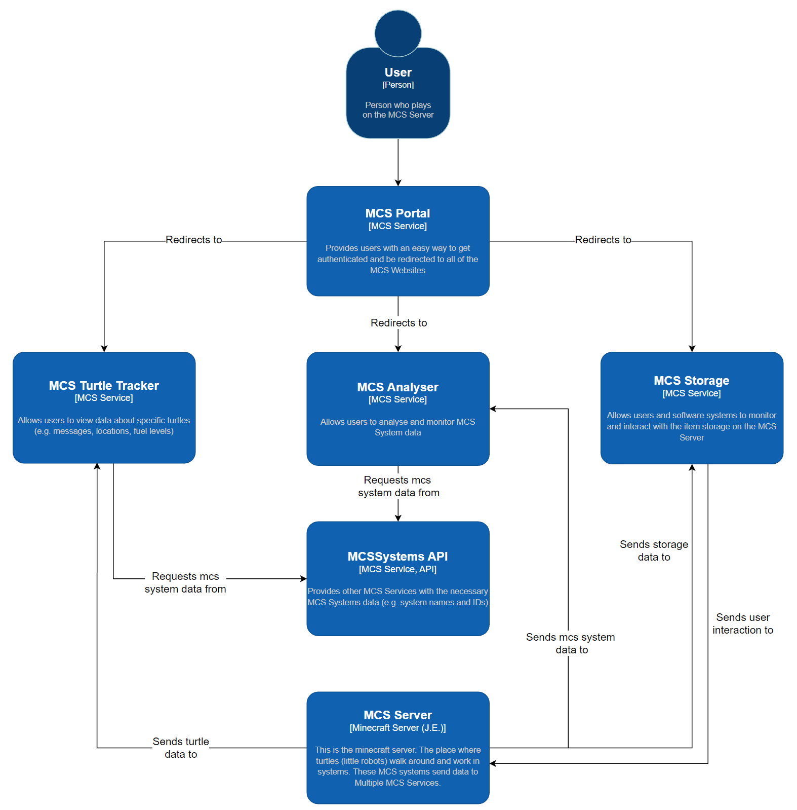

# Portfolio S3

## Table of Contents
- [Portfolio S3](#portfolio-s3)
  * [Table of Contents](#table-of-contents)
  * [Introduction](#introduction)
- [F1 Guesser](#f1-guesser)
  * [Project Description](#project-description)
  * [Full-Stack Web Application](#full-stack-web-application)
  * [Requirements](#requirements)
  * [Conclusion](#conclusion)
- [Project MCS Analyser](#project-mcs-analyser)
  * [Project Description](#project-description-1)
    + [But what is MCS-CC?](#but-what-is-mcs-cc)
    + [User Stories](#user-stories)
  * [Full-Stack Web Application](#full-stack-web-application-1)
    + [Front End](#front-end)
    + [Back End](#back-end)
    + [Persistence](#persistence)
  * [External Services](#external-services)
    + [Systems and Services explained](#systems-and-services-explained)
  * [Project Management](#project-management)
  * [Quality Assurance](#quality-assurance)
  * [Continuous Integration & Delivery](#continuous-integration--delivery)
    + [Integration](#integration)
    + [Delivery](#delivery)
  * [Deployment](#deployment)

## Introduction
This semester has the goal to work on a group project for an external company and to build a Full-Stack web application as an individual project. Together with these projects there are many learning outcomes that should be achieved. This document will show how I worked towards my so called LO’s.

# F1 Guesser

## Project Description
For my individual project, I want to build a web application where you can guess Formula One race outcomes against your friends to compete for the most points at the end of the Formula One season.

## Full-Stack Web Application
The application should consist of a separate front-end and back-end. The back-end should be build using an Object Oriented framework whereas the front-end needs to use a JavaScript framework.

## Requirements
I’ve created a few simple requirements to give a better understanding about the project and the functionality that will be available.

**FR-01:** The user should be able to create a playgroup.
- B-01.1: A maximum of 8 people are allowed per playgroup.

**FR-02:** A user should be able to join a playgroup using a code from another user’s group.
- B-02.1: If the playgroup is full, the user that wants to join gets a pop-up that says that the playgroup is full.

**FR-03:** The user should be able to see how many points other people in his playgroup have.
- K-03.1: A user’s points is shown next to the user’s username.
- K-03.2: The user should be able to see a bar chart of all the points of the members of his playgroup.

**FR-04:** The user should be able to see a countdown to the next race week.
- K-04.1: A race week is from Monday till Sunday, if there’s a race on Sunday.
- B-04.2: The time to a next race week is only visible if a race week is not already happening

**FR-05:** The user should be able to go through a round of questions
- B-05.1: The user can only go through a round of questions during a race week.
- B-05.2: The user can only go through a round of questions when in a playgroup.
- K-05.1: During the round the user is able to select a F1 driver to answer each question.
- K-05.2: During the round the user gets to see how many points are available for each question.

**FR-06:** The user can see what answers other members of his playgroup have selected.
- B-06.1: The user can only see other member’s answers after having gone through the round of questions himself

**FR-07:** After a race week the user gets the available points for each question answered correctly.

## Conclusion
After a lot of doubt, I have chosen to change projects. Together with a few friends I have been playing on a Minecraft Server which has a mod (expansion) that adds programmable robots and computers to the game. I have a lot of motivation to build a project which uses data from those robots and computers.

Luckily, I will be able to use the knowledge I got in the last few weeks in my next project.

# Project MCS Analyser

## Project Description
I want to build a web application that gives users the ability to see and analyse data produced by robots on a Minecraft server. These Robots are part of a mod called MCS-CC.

### But what is MCS-CC?
MCS-CC, also known as Minecraft Synergy Computer Craft, is a by us (the MCS Team) made modification of the popular mod: “CC: Tweaked” (Which is also on itself a modification of another mod). CC: Tweaked adds programmable turtles and computers to Minecraft (Java edition). These turtles are essentially robots that can perform certain actions like digging blocks or moving items from one place to another. To have a turtle (or computer) perform an action you can write a script in a language called Lua which is then ran in the Lua Virtual Machine to actually make the turtle do something.

Using these computers and turtles you can automate almost everything in the game. 

### User Stories
I’ve created a few user stories to make the project and its functionality more clear. I chose user stories over requirements, because I already created requirements for my last project and want to see the difference.

- US-01: As a user I want to be able to see a system’s data displayed as a graph, so that I can analyse and monitor the system.
- US-02: As a user I want to be able to change a graph’s timespan so that I can analyse data over different amounts of time.
- US-03: As a user I want to see new data as soon as it’s available so that I can react to an unexpected situation quickly.
- US-04: As a user I want to be able to see if a system is turned on or off so that I know why a system is producing different data then before.
- US-05: As a user I want to be able get a description of a system about it’s service and purpose so that I can understand the data more easily.
- US-06: As a user I want to be able to create a custom graph with all the data available so that I can compare different systems with each other.

## Full-Stack Web Application
### Front End
For the front-end part of the application I have to use a JavaScript framework. After a bit of research about what options are available, it quickly comes down to Vue and React.  I haven’t done a lot with JavaScript before so I played around a little with both of the frameworks to see which one I would like more. I found out that anything and everything is possible with both of the frameworks, but React felt more intuitive to me. As a result I have chosen to build my front-end with ReactJS.

Click [here](https://github.com/MC-Synergy/MCSAnalyser-FrontEnd) to go to the front end repository.

### Back End
For the back-end part of the application I want to work with an object oriented language. This means the big options are C# and Java. It’s important for a software engineer to be able to learn and apply new technologies. I have been using C# in the last two semesters and really want to expand my knowledge towards Java. I have no experience with Java at this point, but it’s one of the most used object oriented languages for back-end applications. One of the best Java frameworks for REST applications is Java Spring. This is also what I will be using for my project.

Click [here](https://github.com/MC-Synergy/MCSAnalyser-API) to go to the back end repository.

### Persistence
One of the (few) mandatory things this semester is that I learn about an Object-Relational Mapper and how to apply that knowledge in my project. Object relational mapping is, simply said, a technique that lets you manage data in database without having to write data access logic (because the ORM serves as the data access layer!). ORM has a lot of pros and cons, they can for example be very overwhelming to use and aren’t always the most performant. Nonetheless ORM’s can be super useful to abstract your database and save you a lot of time.

Hibernate is a framework that implements object relational mapping for Java applications. Part of the Spring framework is Spring Data JPA, which is an extra layer of abstraction on top of hibernate. Hibernate makes it possible to switch a project’s database without changing the back-end code, while Spring Data JPA reduces the needed back-end code to implement hibernate. I will be using Spring Data JPA together with hibernate and MySQL to achieve persistence in MCS Analyser.

## External Services
MCS Analyser will be using multiple external services made by the MCS Team. Most of these services will be used to gather data to be displayed by the analyser. There has also been the idea to authorize all of the MCS Services. This would mean that MCS Analyser would use the MCS Authentication Provider to authenticate our users.

To create a better understanding of how the different MCS Services interact with each other, I have designed a system context diagram following level 1 of the C4 model pattern.


 
### Systems and Services explained
In this document there has been a lot of talk about MCS Systems and MCS Services, but what is the difference? MCS Systems are the systems inside the Minecraft server. For example a farm that produces melons and pumpkins is called an MCS System. All the systems are registered at the MCS Systems API. MCS Services are the things we build outside of the Minecraft server. For example the MCS Analyser and the MCS Turtle Tracker are both MCS Services.

## Project Management
TODO ------------------ TODO  
Agile, Research document, github issues, Jira, stakeholders  
laat voorbeeld van een afgewerkte issue zien

## Quality Assurance
Assuring the quality of software is one of the most important things in software development as it helps you to find problems before they become an issue. There are many different subjects in software which "the quality can be assured of". For my project a few things are important. First of all, the data that is displayed in the graphs should be correct and not be misleading. Both of these things could lead to misunderstanding of the data that a system produces, which would be a problem for the further development of the system. Second, a user (player from the minecraft server) should be able to easily find what they are looking for and understand the data that a system is producing, even if they don't have an understanding about the development of MCS Systems.
To test if these things are working as needed, I will be doing Integration Tests and User Experience Tests. I will also be running performance and accessibility tests through google lighthouse, because this will help to find issues with the user experience and google lighthouse can also scan for vulnerability issues.

### Integration Tests

### Google Lighthouse (Performance testing and more)

### User Experience Tests

## Continuous Integration & Delivery
Integrating new code into an application takes developers a lot of time. That's why I have automated the integration, delivery and deployment of new code. To automate this process I have created workflows with GitHub Actions. These workflows are triggerd on push or accepted pull requests on the development and main branches of the projects. There are workflows for building and testing the code, aswell as there are workflows for building and delivering docker images to a self-hosted docker registry.

Workflows exist of jobs that are run so called GitHub Runners. We are currently hosting our own GitHub Runners, however I really wanted to set my GitHub Repository to public but this came with some complications. You can read more about this in my Research Article: [Repositories: Private or Public?](https://github.com/crazyvinvin/Portfolio-S3/blob/main/Research/repositories-public-or-private.md)

### Integration
When a pull request is opened against the development or main branch of the front end repository or when a push to the development branch happens, the integration workflow is run.

``` yaml
# integrate.yml
---
name: integrate

on:
  pull_request: 
    branches: ["main", "dev"]
  push:
    branches: ["dev"]
  workflow_dispatch:

jobs:
  build:
    runs-on: ubuntu-latest
    steps:
      - uses: actions/checkout@v3
      - uses: actions/setup-node@v3
        with:
          node-version: 18.12.1
      - name: setup git config
        run: |
          git config user.name "GitHub Actions Bot"
          git config user.email "<>"
        
      - name: install dependencies
        run: npm ci
      
      - name: Build code
        run: npm run build
```
The integration workflow has a job that builds the application. If the code has build errors, the workflow will fail which will be visisble on github and it will also be emailed to the developer. The integration workflow will also be running a test job.

### Delivery
To deliver new code, a few steps have to be processed:
- Build the code
- Build the Docker image
- Login to self-hosted registry
- Push Docker image to registry

``` Dockerfile
# Dockerfile
FROM node:19-alpine as builder
WORKDIR /app

COPY package*.json ./

RUN npm ci

COPY . .

RUN npm run build

FROM nginx:1.23.1-alpine as production
ENV NODE_ENV production
COPY --from=builder /app/build /usr/share/nginx/html
COPY nginx.conf /etc/nginx/conf.d/default.conf

CMD ["nginx", "-g", "daemon off;"]
```

The docker file is responsible for installing the code's dependencies, building the code and then building the Docker image.

``` yaml
# deliver.yml
---
name: Deliver

on: 
  push:
    branches: ["main"]
  pull_request_review:
    types: [submitted]
  workflow_dispatch:

jobs:
  Docker:
    runs-on: ubuntu-latest
    steps:
      - uses: actions/checkout@v3
      
      - name: Login to registry
        run: >
          echo ${{ secrets.REGISTRY_PASSWORD }}
          | sudo docker login registry.mcsynergy.nl
          -u ${{ secrets.REGISTRY_USERNAME }} --password-stdin
      
      - name: Build image
        run: >
          sudo docker build . --file Dockerfile
          --tag registry.mcsynergy.nl/mcsa-frontend:latest
      
      - name: Push to registry
        run: sudo docker push registry.mcsynergy.nl/mcsa-frontend:latest
```
The delivery workflow runs the dockerfile to create a new image. It then logs in to the registry and pushes the newly created image. The reason why I have chosen to host my own registry is because on the docker-hosted registry you have to pay to store more than 1 private image. I want to store atleast 2 private images and probably even more in the future. The registry is authenticated using basic username and password authentication.

## Deployment
At home I have a super old intel NUC that serves as my server. To be able to really use my application I had to deploy the Docker images stored in my registry as Docker containers. To do this I have written a docker-compose file for each application. 

``` yaml
# docker-compose.yml
version: '3.8'

name: MCSAnalyser
networks:
  mcsa-net:
    external: true

services:
  mcsa-server:
    container_name: MCSA-API
    restart: always
    environment:
      SPRING_DATASOURCE_URL: 'jdbc:mysql://MCSA-Database:3306/mcsaDB'
      SPRING_DATASOURCE_USERNAME: 'root'
      SPRING_DATASOURCE_PASSWORD: '****'
      SPRING_JPA_HIBERNATE_DDL-AUTO: 'update'
      SPRING_JPA_DATABASE-PLATFORM: 'org.hibernate.dialect.MySQL5InnoDBDialect'
      SERVER.SERVLET.CONTEXT-PATH: ''
      CREATEDATABASEIFNOTEXISTS: true
      SERVER_PORT: 8081
      SERVER_ADDRESS: 0.0.0.0
    image: registry.mcsynergy.nl/mcsaserver:latest
    ports:
      - "8081:8081"
    depends_on:
      - mcsa-db
    networks: 
      - mcsa-net

  mcsa-db:
    image: mysql:latest
    restart: always
    container_name: MCSA-Database
    environment:
      MYSQL_DATABASE: 'mcsaDB'
      MYSQL_ROOT_PASSWORD: '****'
    ports:
      - "18701:3306"
    volumes:
      - mcsa-db-volume:/var/lib/mysql
    networks:
      - mcsa-net

volumes:
  mcsa-db-volume:
```
This is the docker-compose file for the back end of my project. It spins up two containers, one that serves as the database and one based on the image from my code. A network is created for the database and java application to communicate to eachother. I have made sure that the MySQL container starts before the java application starts. This is done by teling docker that the java application depends on the database.

To automatically deploy a new container when a new image is pushed to the registry, I use watchtower. I have set up a watchtower container that checks for new images every minute. As soon as it realises a new image has been delivered, it shuts down the old container and boots up a new container with the same configuration. It also holds track of which containers are dependend of others and will take action accordingly.

To be able to access the containers, I have a domain name set to my IP Address which can be checked out [here](https://mcsynergy.nl). I use NGINX as a reverse proxy which means - very simply said - that it will make sure your request is handled by the right container.
``` nginx
server {
        listen 443;
        server_name registry.mcsynergy.nl;

        location / {
                proxy_pass http://localhost:5000/v2;
        }

        location /v2 {
                client_max_body_size 2000M;
                proxy_pass http://localhost:5000/v2;
        }
    ssl_certificate /etc/letsencrypt/live/mcsynergy.nl/fullchain.pem; # managed by Certbot
    ssl_certificate_key /etc/letsencrypt/live/mcsynergy.nl/privkey.pem; # managed by Certbot
}
```

When I send a request to "https://registry.mcsynergy.nl", I want it to go to the registry. And when I send a request to "https://www.mcsynergy.nl", I want it to go to the front end container. All these subdomains point to the same IP Address, but NGINX handles them differently. I have also setup a secure SSL connection using certbot and lets encrypt. This will help with securing the data being send to and from the client while also scoring some extra SEO (Search Engine Optimization) points.
