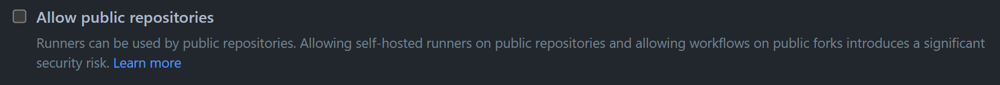

# How can I safely allow GitHub Actions Jobs on a public repository?
While setting up my CI/CD pipelines on github, I ran into this issue where our github runners would not pick up jobs waiting to be executed. After typing some random stuff into google, I found out this was happening because the jobs came from a git repository set to public. The easy solution was to just allow jobs from public repositories on our github runners, but then I stumbled upon this note:

"Allowing self-hosted runners on public repositories and allowing workflows on public forks introduces a significant security risk."
As our github runners are not isolated in a virtual machine and are being hosted on the same machine as most of the MCS Services, this sounded like something I had to dive in a little deeper before simply enabling it.

### What is the risk of allowing jobs from a public repository?
The problem with allowing jobs from a public repository is that **anyone can fork your repository**, add a workflow that triggers on a pull request and then create a pull request. The created workflow will then be executed and its jobs will be put into a queue, waiting to be picked up by one of our runners. This makes it possible for anyone to run shell commands on the machine, hosting the runner. (github security guides, 2023)

### Why would you want your repository to be public?
A lot of features like protecting branches or assigning multiple people to one issue are behind a paywall github. However, many of these paywalls can be bypassed by setting your repository to public. (github pricing, 2023)
Public repositories also allow you to share your work with other developers more easily so that they don't have to reinvent the wheel twice or so that they can be inspired to create their own projects.

### Protecting our github runners
I have found a few things that would help to protect our github runners and their host machines against malicious code, while still having our repositories set to public.

First of all I allowed the github runners to run jobs only from **selected** repositories. This results in members of our github organization not being able to simply create a public repository and have it be attacked by malicious people 
without checking in with one of the admins. 

After that I enabled the option to require approval for all outside collaborators to run workflows on their pull requests and also set workflow permissions to only be able to read a repository's content.

What we could also do is setup a virtual machine and create a self-hosted runner to be executed inside the virtual machine. We could then configure this runner to allow jobs from public repositories and disable it for the other runners. (github github-hosted-runners, 2023)

During the writing of this article I found out it is actually free for public repositories to use the github-hosted runners, instead of the maximum of 2000 minutes for private repositories. (github pricing, 2022) Using the github runners will always be the safest thing together with setting your repository to private, but setting up and hosting your own runners is definitely more fun.

#### Research
I have performed workshop research by prototyping and trying different ways of setting up self-hosted github runners. I have also performed library research by doing studying literature on the internet. There has also been problem analysis, which was achieved by literature study.

#### Sources  
- https://docs.github.com/en/actions/hosting-your-own-runners/about-self-hosted-runners
- https://docs.github.com/en/actions/security-guides/security-hardening-for-github-actions#hardening-for-self-hosted-runners
- https://docs.github.com/en/actions/using-github-hosted-runners/about-github-hosted-runners#overview-of-github-hosted-runners
- https://github.com/pricing#compare-features
